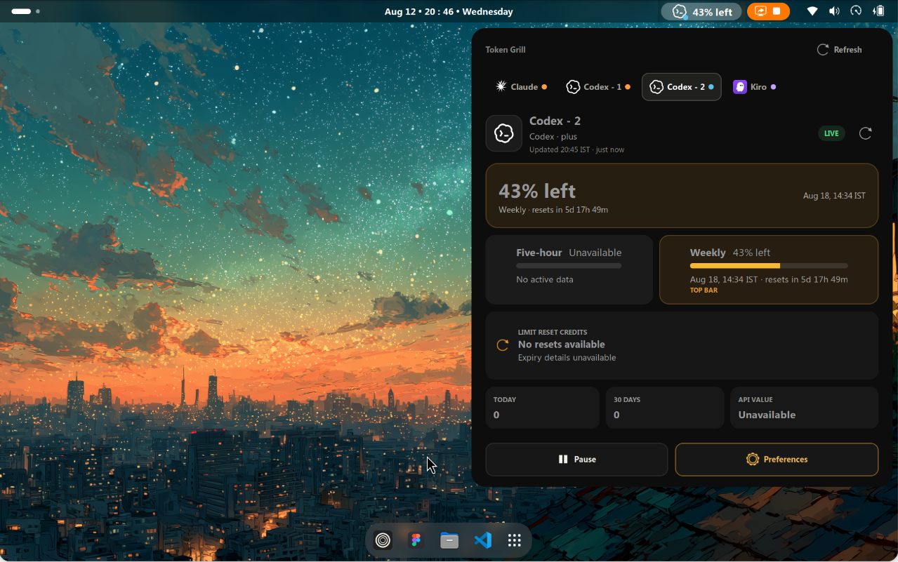
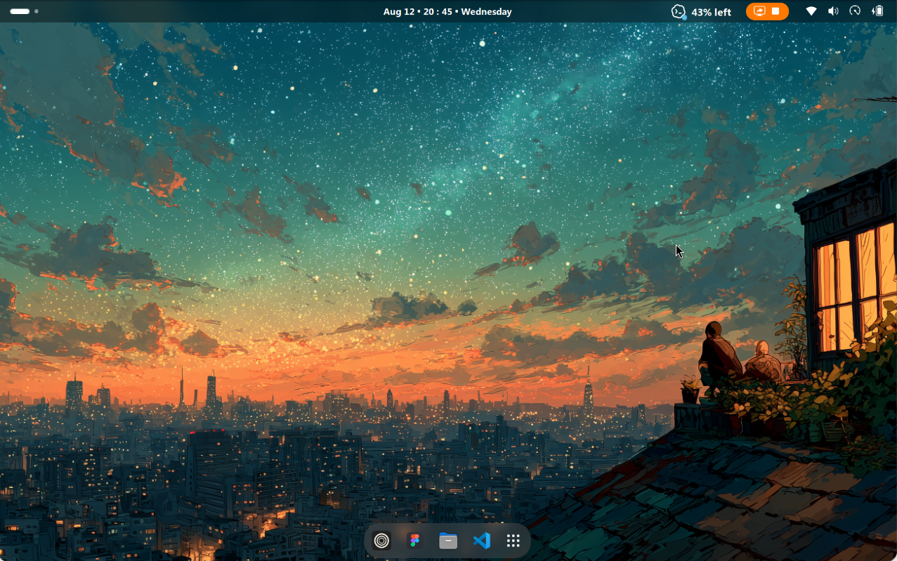

# Token Grill

Monitor AI usage limits from the GNOME top bar.

Token Grill puts live AI usage in the GNOME top bar. It can follow several
accounts at once, so you can see what remains, switch accounts, and check reset
times without interrupting your work.



## What it does

- Monitors multiple Codex, Claude, Kiro, Antigravity, DeepSeek, Kimi Code, and OpenCode Zen / Go accounts.
- Shows the active account in the top bar as text, a ring, or a compact bar.
- Displays provider quota windows and reset times in your local timezone.
- Switches between accounts from the popup.
- Reports fresh, stale, partial, and failed refreshes without throwing away the
  last useful reading.
- Sends optional milestone notifications.
- Reads local Codex and Claude session history when you enable history for an
  account. It stores totals, never prompts or responses.
- Shows Codex reset-credit availability without redeeming a credit.



## Install

Token Grill supports **GNOME Shell 50**.

After its first release is approved, install it by searching for **Token Grill**
in [Extension Manager](https://mattjakeman.com/apps/extension-manager) or on
[GNOME Shell Extensions](https://extensions.gnome.org/). This is the recommended
path and provides normal extension updates.

To test a release archive before approval:

```sh
gnome-extensions install --force tokengrill@sh02sahil.github.io.shell-extension.zip
```

Log out and back in if GNOME does not discover the extension immediately, then
enable Token Grill in Extension Manager or the Extensions app.

## Set up an account

1. Sign in with the provider's CLI first. Token Grill does not perform logins.
2. Open Token Grill's extension preferences.
3. Select **Discover** to find standard account directories, or select
   **Add provider** to enter a directory yourself.
4. Choose which account appears in the top bar and whether Token Grill may scan
   its local history.

Typical account locations are `~/.codex`, `~/.claude`, and
`$XDG_DATA_HOME/kiro-cli`. Separate homes such as `~/.codex2` remain separate
accounts.

Kiro support also needs the Gda 5.0 SQLite GObject-introspection binding from
your Linux distribution.

### DeepSeek, Kimi Code, and OpenCode

- **DeepSeek:** shows the available prepaid balance, including its currency,
  rather than a quota percentage. By default it reads the `deepseek` API key
  from `$XDG_DATA_HOME/opencode/auth.json` (normally `~/.local/share/opencode/auth.json`).
- **Kimi Code:** shows five-hour, weekly, and monthly subscription quotas.
  It reads `~/.kimi-code/config.toml` and the credential file referenced by that
  configuration under `credentials/`. Both mainland China and global endpoints
  are supported. Legacy `~/.kimi` homes can also be selected. Credentials are
  read-only; if the token expires, start `kimi` and run `/login` to refresh it.
  This is Kimi Code, not the separate Moonshot prepaid API.
- **OpenCode Zen / Go:** reads the `opencode-go` or `opencode` API key from the
  OpenCode `auth.json` file and shows Go's rolling, weekly, and monthly quotas.
  The quota endpoint requires a **Go subscription**. Zen pay-as-you-go accounts
  receive an explanatory error because that endpoint does not expose their balance.

Run `opencode auth login` to configure DeepSeek or OpenCode keys. Alternatively,
select a private JSON file containing `{"api_key":"your-key"}` through the
provider's **Auth file override**. A Kimi Code API key can use the same format;
its configured region still determines the endpoint. Never put API keys in
Token Grill's settings. Local history is not supported for these three providers.

All provider icons use LobeHub's monochrome set, with white and black variants
for dark and light backgrounds.

## Privacy and network access

Token Grill reads credentials from the account directories you configure and
sends them only to that provider's HTTPS usage service. The Sign in button can
open a terminal running the provider's CLI. Collection does not run provider
CLIs, collect telemetry, or send prompt and response content anywhere.

The extension stores compact usage totals under the XDG data directory and
parser checkpoints under the XDG state directory. Credentials, provider
responses, prompts, and responses are not copied into Token Grill's files.

Kiro's SQLite authentication store is opened read-only. If its OIDC access token
has expired, Token Grill may refresh it in memory; it does not write the refreshed
credential back to Kiro's database.

## Why this exists

Token Grill began as a personal tool. I wanted one GNOME extension that could
handle multiple accounts, the providers I use while coding, compact panel
display modes, clear reset information, and privacy-conscious local history.
I could not find an existing extension that covered that combination, so I
built this one and decided to share it.

Codex, Claude, and Kiro make up the first rollout because they are the services
I currently use. More providers may follow when they can be supported without
weakening the extension's privacy or reliability.

## AI development declaration

AI played a substantial role in Token Grill's development. The project was
created for personal use with **OpenAI GPT-5.6 Sol**, using medium reasoning
through **Codex**. **T3 Code** served as the agentic coding environment and
orchestration interface around Codex.

AI assistance covered design exploration, implementation, refactoring, tests,
security review, and documentation. I directed that work, tested the resulting
extension, reviewed what is published, and remain responsible for maintaining
and explaining the code.

## Troubleshooting

- **Login required:** open the provider's CLI and sign in again.
- **Kiro database unreadable:** install the Gda 5.0 SQLite binding and restart
  the preferences window.
- **No history:** enable local history for that account and confirm its session
  directory exists.
- **Changes do not appear:** disable and re-enable the extension. On Wayland,
  log out and back in after replacing extension files.
- **A provider changed its API:** open an issue with the error text, but never
  attach credentials or a real session log.

## Contributing

Bug reports and focused pull requests are welcome. Read
[CONTRIBUTING.md](CONTRIBUTING.md) before sharing logs or account fixtures.

## Independence and license

Token Grill is an independent project. OpenAI, Anthropic, and Kiro do not
endorse or sponsor it. Provider marks identify their services; see
[NOTICE.md](NOTICE.md) for sources and terms.

Token Grill is released under GPL-3.0-or-later. See [LICENSE](LICENSE).
